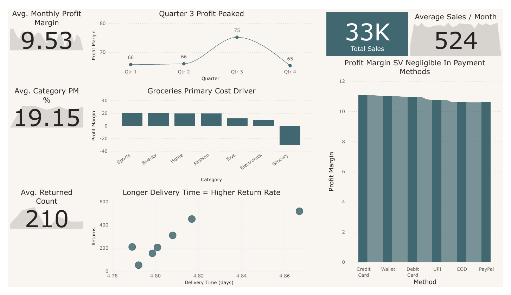
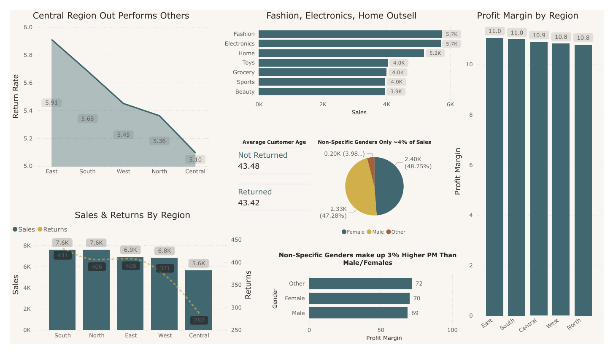

# eCommerce Sales: A Case Study
*By Andrew Castro*

---

The eCommerce Sale data was downloaded from a publicly sourced dataset on Kaggle, which can be found [here](https://www.kaggle.com/datasets/miadul/e-commerce-sales-transactions-dataset). I first imported it into Microsoft Excel to analyze the Column Dictionary available, which notably contained the following columns: `order_id`, `customer_id`, `product_id`, `category`, `price`, `discount`, `quantity`, `payment_method`, `order_date`, `delivery_time_days`, `region`, `returned`, `total_amount`, `shipping_cost`, `profit_margin`, `customer_age`, and `customer_gender`.

## Hypotheses
* **Hypothesis 1:** Credit Card sales will have amongst the highest profit margins.
* **Hypothesis 2:** Longer shipment times will negatively impact return rates.

---
## EDA & Methodology

There are many complex dynamics which can be explored in this dataset in collaboration with the hypotheses above. There may be a correlation in reliability and increase of sales that may scale progressively with the customer’s age. Geographical data such as regions may also represent differing data validating the hypothesis in one, but invalidating it in another. The balance between the shipping costs and our COG may represent that certain categories will sell better or worse in some regions more than others. 

The dataset was first loaded into Microsoft Excel, and then a pandas DataFrame for cleaning and initial analysis. Key data preparation steps included:

Python Pandas was used to demonstrate proficiency with coded data manipulation and the potential for automated frequency to improve redundant project efficiency.

### Column Renaming & Data Transformation:
1.  The raw .CSV had a column, ‘profit_margin’,  however the dataset did not correctly reflect these statistics. It was renamed to ‘absolute_profit’.
2.  ‘total_amount’ was renamed to ‘total_price’, for clarity.
3.  ‘shipping_cost’ renamed to ‘internal_shipping_cost’, for clarity.
4.  ‘order_date’ column was converted from a generic text format (object) to a datetime format. This was a crucial step to enable any time-based analysis, such as grouping sales by month.
5.  Two new columns were created to support deeper analysis:
    * **profit_margin:** A new column was generated to calculate the actual profit margin percentage using the formula: `(absolute_profit / total_price) * 100`.
    * **order_month:** A new column was created from `order_date` to represent the specific year and month of each sale (e.g., '2025-04'), which was necessary for monthly reporting.

After loading the manipulated CSV files into Power BI, the first row of data  (which contained the intended column names) was promoted to become the table's official headers using the "Use First Row as Headers" function, on certain files  that Power BI failed to automatically index correctly. Additionally the ‘yes’ and ‘no’ fields in the ‘Returned’ column were modified to represent ‘Returned’ and ‘Not Returned’ for dashboard clarity.

**Verification:** All other numerical columns, such as `customer_age`, were verified to be in the correct format for statistical measurement.

---
## Results & Dashboard

**Hypothesis 1 (VERIFIED - Neutral):** Credit Card sales will have amongst the highest profit margins.

**Hypothesis 2 (VERIFIED - True):** Longer shipment times will negatively impact return rates.

#### Payment Methods & Profit Margins
  As hypothesized, Credit Card sales do have the highest profit margins amongst the payment methods. However, the variance in margin is negligible. While Credit Card transactions yielded the highest average profit margin of 11.09%, the lowest payment method (PayPal and CoD) only yielded about a -0.49% variance. This indicates that the customer’s choice of payment method is not a significant profitability driving factor in our model. 

#### Longer Delivery Times & Returns
  Longer delivery windows correlate strongly with higher return rates. As the delivery time increases in days, the scatter plot based on our dataset model indicates that customer satisfaction may be negatively impacted, and thus leading to an increase in returns. Logistical efficiency may be a key factor in maintaining customer satisfaction and reducing our return rates.

#### Profit Margin Peak
  Quarter three saw a 13.64% increase in our profit margin, bringing our average from 66% to 75% before dipping back down to the baseline in quarter four. This suggests a potential seasonal high (July, August, September) that can be strategically leveraged in the future to drive customers into loyalty systems. 

#### Groceries Are a Primary Cost Driver
  The Grocery category is significantly unprofitable and is hurting our baseline, with a remarkable -29.68% average profit margin. Groceries are among our lowest return rates, and lowest selling category. This indicates that our production cost (CoGS), shipping, and sale prices in dynamic  need to be re-evalulated. 

#### The Central Region
  Although the Central region may go unnoticed due to lower total sales (5.6k versus 7.6k in the South and North), the Central region outperforms other regions with its noticeably lower return rate (5.10%) and average performing Profit Margin (10.9%).  We should analyze the factors contributing to this success- be it specific services, warehouse efficiency, or shipment speed—and attempt to replicate these best practices in other regions to improve overall profitability.

#### Demographics
  The demographic base of male (48.75%)  and female (47.28%)  is split quite neutrally, and both perform about equally (69% and 70% respectively) in profit margins. However, notably non-specific gender demographics make up only approximately 3.8% of the total sales, yet outperform the profit margin of male(s) and female(s) identifying customers by nearly 2-3% . 

---
#### Conclusion
  This case study found that while payment methods minimally affect profit margins, longer delivery times significantly increase return rates. Groceries were identified as the largest loss driver (-29.68% margin), while Q3 sales showed a seasonal opportunity (+13.64%). To improve profitability, the business should optimize logistics, re-evaluate grocery operations, and strategically leverage seasonal demand.

* Credit card sales yield slightly higher profit margins (+0.49% vs PayPal/CoD).
* Longer delivery times correlate with higher returns.
* Groceries show –29.68% profit margin (major loss driver).
* Q3 profit margin peaks at 75% (+13.64% above baseline).
* The central region performs well (low returns, steady margins).
